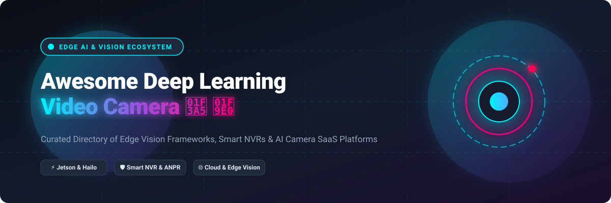

# Awesome-Deep-Learning-Video-Camera

# Awesome-Deep-Learning-Video-Camera 🎥 🧠



  





  
  
  
  
  
  



---

## 🌟 Top Deep Learning Video Camera Ecosystem

**Curated List of Commercial AI Camera Platforms & Open-Source Edge Vision Frameworks**  
*Focused on Edge AI Inference, Video Analytics, Smart Surveillance, Hardware Accelerators, Privacy-Preserving Vision & Self-Hosted Camera Management*

**Last updated: October 2026** 📅

---

### 📌 Overview & SEO Summary
Welcome to the ultimate curated directory of **deep learning video cameras**, **open-source edge vision frameworks**, and **AI-powered surveillance platforms**. Whether you are looking for enterprise-grade commercial solutions (such as *Verkada*, *Rhombus*, and *Cisco Meraki MV*), or self-hostable open-source alternatives (like *Frigate*, *DeepStream*, and *Carcara Vision*), this list covers category leaders, edge accelerators, and privacy-respecting intelligent video systems.

**Key Market Context:**
- **AWS DeepLens reached End of Life on January 31, 2024** — all models, projects, and device information have been deleted from the AWS DeepLens service, and the device no longer receives security updates .
- **Google Coral Edge TPU** provides **4 TOPS of INT8 inference at ~2W**, but **Google has released no new Coral hardware since 2022** — treat it as a legacy choice for existing fleets .
- **NVIDIA Jetson Platform Services** now provides **containerized AI services** for video analytics, VLM inference, and zero-shot detection on Jetson Orin devices .

---

## 📑 Table of Contents
- [🏢 SaaS & Commercial Platforms](#-saas--commercial-platforms)
- [🔓 Open-Source GitHub Projects](#-open-source-github-projects)
- [🛠️ How to Contribute](#%EF%B8%8F-how-to-contribute)
- [📊 Star History](#-star-history)
- [🤝 Support & Sponsorship](#-support--sponsorship)
- [⚠️ Disclaimer](#%EF%B8%8F-disclaimer)

---

## 🏢 SaaS & Commercial Platforms

The deep learning video camera market spans **hardware + cloud camera platforms** (Verkada, Rhombus, Meraki MV) that provide **managed cameras with built-in AI analytics**, **edge AI development kits** (NVIDIA Jetson, Google Coral, Intel RealSense) that offer **programmable hardware for custom vision applications**, and **video analytics software platforms** (Spot AI, BriefCam) that add **AI capabilities to existing camera infrastructure**. **AWS DeepLens** is **discontinued** — the service was fully shut down on January 31, 2024 . **Google Coral** hardware remains available (~$60 for USB accelerator) but **no new hardware has shipped since 2022** . **NVIDIA Jetson Orin** modules provide **up to 275 TOPS** for edge AI inference.

| SaaS / Commercial Platform | Company / Owner | Valuation / Market Cap | Standard Edition Starting Price | Free Tier / Free Trial Limits | Description |
| :--- | :--- | :--- | :--- | :--- | :--- |
| **[Verkada](https://www.verkada.com/)** 🎥 | Verkada | Private | **~$1,000+/camera** (hardware) + subscription | **Demo available** | **Cloud-managed AI cameras** — **Built-in person detection, vehicle detection, and anomaly detection** . **Hybrid cloud architecture** with **edge processing + cloud management** . **Centralized management** across unlimited sites. |
| **[Rhombus Systems](https://www.rhombus.com/)** 🔷 | Rhombus | Private | **Custom pricing** | **Demo available** | **Cloud-managed AI camera platform** — **Person detection, motion detection, and people counting** . **Unlimited cloud storage** with **edge caching** . **API for integration** . |
| **[Cisco Meraki MV](https://meraki.cisco.com/)** 🔵 | Cisco | ~$200 Billion | **~$500–$1,500/camera** + license | **Demo available** | **Cloud-managed smart cameras** — **Built-in ML for person detection and motion** . **Edge processing** with **local storage** . **Deep integration** with Meraki networking and security. |
| **[Spot AI](https://www.spot.ai/)** 🟢 | Spot AI | Private | **Custom pricing** (hardware + subscription) | **Demo available** | **AI video intelligence platform** — **Natural language search** across video footage . **Person detection, vehicle detection, and motion analytics** . **Works with existing cameras** . |
| **[NVIDIA Jetson](https://developer.nvidia.com/embedded/jetson)** 🟩 | NVIDIA | ~$3 Trillion | **$149+** (Jetson Orin Nano) | **Free SDK and tools** | **Edge AI computing platform** — **Up to 275 TOPS** on Jetson AGX Orin . **JetPack SDK** with **CUDA, cuDNN, TensorRT, and DeepStream** . **Jetson Platform Services** for **containerized video analytics, VLM inference, and zero-shot detection** . |
| **[Google Coral](https://coral.ai/)** 🟡 | Google Research | ~$2.0 Trillion | **~$60** (USB Edge TPU) | **Free software and models** | **Edge TPU ML accelerator** — **4 TOPS INT8 inference at ~2W** . **Supports TensorFlow Lite models** . **Coral SoM with NXP i.MX 8M** for embedded devices . **Note: No new hardware since 2022** . |
| **[Intel RealSense](https://www.intelrealsense.com/)** 🔵 | Intel | ~$100 Billion | **$249+** (D455 depth camera) | **Free SDK** | **Depth-sensing cameras with AI** — **Stereo depth, tracking, and object detection** . **RealSense SDK 2.0** for **depth, color, and infrared streams** . **Used for robotics, drones, and smart cameras** . |
| **[OAK-D (Luxonis)](https://www.luxonis.com/)** 🌳 | Luxonis | Private | **$149+** (OAK-D Lite) | **Free DepthAI SDK** | **Spatial AI cameras** — **Depth + RGB + AI processing on-device** . **Intel Movidius VPU** for **neural inference** . **Open-source DepthAI framework** . **Ideal for robotics and edge vision** . |
| **[Azure Percept](https://azure.microsoft.com/en-us/products/ai-services/azure-percept/)** 🔷 | Microsoft | ~$3.90 Trillion | **Discontinued** | **Service retired** | **Edge AI platform (discontinued)** — **Azure Percept was a hardware + cloud AI platform** for edge vision. **Service has been retired** . |
| **[AWS DeepLens](https://aws.amazon.com/deeplens/)** ⚠️ | Amazon | ~$2.0 Trillion | **End of Life: January 31, 2024**  | **Service discontinued** | **Deep learning camera (discontinued)** — **All references deleted from AWS service** . **No security updates** . **AWS encourages recycling** . |

---

## 🔓 Open-Source GitHub Projects

*Sorted by GitHub_Stars_Count (Descending)* 🌟

- **[Frigate](https://github.com/blakeblackshear/frigate)**   
  **NVR with real-time object detection for IP cameras**, MIT licensed. **The most popular open-source AI video surveillance platform** — **real-time object detection using TensorFlow, OpenCV, and Coral Edge TPU** . **Works with any RTSP camera** . **Low-latency live view** and **event-based recording** . **Integrates with Home Assistant** . **Supports Coral, Hailo, and GPU acceleration** . **The definitive open-source AI camera platform** . 🎥

- **[DeepStream SDK](https://github.com/NVIDIA-AI-IOT/deepstream_python_apps)**   
  **Python bindings and apps for NVIDIA DeepStream**, MIT licensed. **GStreamer-based pipeline for multi-stream video analytics** . **Hardware-accelerated decode, inference, and tracking** . **Supports PeopleNet, TrafficCamNet, and custom models** . **The foundation for NVIDIA Metropolis deployments** . 🚀

- **[Carcara Vision](https://github.com/marcoscunha/carcara-vision)**   
  **Hardware-accelerated ML inference platform for video surveillance**, MIT licensed. **Multi-model ML** — **YOLO v5/v8/v11 detection + Vision Language Models** . **Hardware acceleration** — **CUDA, TensorRT, Jetson, Coral TPU, Hailo** . **Modular architecture** with **pluggable inference engines** . **GStreamer pipelines** with **MediaMTX (RTSP/WebRTC/HLS)** . **Smart camera discovery** with **persistent V4L2 paths** . **The most modern open-source AI video platform** . 🦅

- **[AI Security Camera (Pi5 + Hailo-8)](https://github.com/mi0iou/ai-security-camera)**   
  **AI security camera running on Raspberry Pi 5 + Hailo-8**, open-source. **YOLOv8s for object detection, YOLOv8n for license plate detection, and EasyOCR for ANPR** . **40+ FPS detection with <100ms end-to-end latency** . **~8W total power consumption** . **Web dashboard with live view and logged objects** . **Mobile notifications via ntfy** . **The most efficient open-source ANPR camera** . 🚗

- **[EvilEye](https://pypi.org/project/evileye/)**   
  **Modular video surveillance pipeline framework**, open-source. **YOLO-based object detection** with **multi-camera tracking** . **JSON configuration** for sources, detectors, trackers, and analytics . **Supports IP cameras, video files, and USB devices** . **Scheduled restarts and GUI** . **The most configurable open-source surveillance framework** . 👁️

- **[Zone Alert (RK3576)](https://github.com/Hanzo-Huang/rk3576-ai-demos)**   
  **Zone-based alerting with YOLO11 on RK3576 NPU**, open-source. **Draw a polygon around a restricted area** — **records events when a person or car enters** . **YOLO11n RKNN model** for **NPU-accelerated inference** . **Browser-based dashboard** with **event history and object crops** . **Everything runs locally** — no cloud dependency . **The most accessible open-source zone alerting system** . 🎯

- **[VideoCignium](https://www.sciencedirect.com/science/article/pii/S2352711026000968)**   
  **Desktop application for automated analysis of surveillance videos**, open-source. **Forensic workflow focus** — **motion detection, YOLO object classification, and OCR timestamp extraction** . **Electron UI with dashboard and Excel reports** . **SQLite database for metadata** . **Offline .exe deployment** . **The most forensics-focused open-source video analysis tool** . 🔍

- **[MoViNet-A0 Stream (LiteRT)](https://huggingface.co/litert-community/MoViNet-A0-Stream-LiteRT)**   
  **On-device streaming video action recognition**, Apache-2.0 licensed. **Recognises human actions across a stream of camera frames** — **one frame at a time, constant memory, real-time** . **15 MB model, 3.75M params** . **4.63 ms p50 on Raspberry Pi 5** . **Kinetics-600: 600 action classes** . **The most efficient open-source action recognition model** . 🏃

- **[Trio Retina](https://pypi.org/project/trio-retina/)**   
  **World-model seam for video analytics**, open-source. **Standardized state between encoders and dynamics models** — **any encoder in front, any dynamics behind, meeting on one serializable state** . **Zone/line/count/dwell events** with **synthetic detections** . **iTwin.js digital twin integration** . **The most innovative open-source world-model framework** . 🌍

- **[AI Surveillance System (5 Detectors)](https://github.com/DumitruEstera/ai-surveillance-system)**   
  **Multi-detector AI surveillance platform**, open-source. **Five detectors concurrent on shared GPU**: **face & demographics (InsightFace), license plate (YOLOv8 + EasyOCR), fire & smoke (YOLOv10), action recognition (SlowFast-R50), weapon detection (YOLOv8m)** . **Temporal event-validation layer** with **multi-frame confirmation and confidence-weighted voting** . **WebSocket annotated frames and PostgreSQL logging** . **The most comprehensive open-source multi-model surveillance system** . 🔬

- **[Intel Object Classification](https://huggingface.co/Intel/object-classification)**   
  **Traffic category classification with OpenVINO**, open-source. **People and Vehicles classification** for **situational awareness and city operations** . **YOLO26 variants (n/s/m/l/x)** with **INT8/FP16/FP32 support** . **CPU, GPU, and NPU deployment** . **The most accessible open-source traffic analytics pipeline** . 🚦

---

## 🛠️ How to Contribute

Contributions are welcome! Follow these steps to submit new deep learning video camera platforms or open-source edge vision software:

1. 🍴 **Fork** the repository.
2. 📝 **Add/edit** entries in `README.md` maintaining table/list structure and formatting.
3. 🔗 Include project title, official website/GitHub link, exact Stars_Count, license, and brief description.
4. 🚀 Submit a **Pull Request** with a descriptive summary of your changes.

---

## 📊 Star History



---

## 🤝 Support & Sponsorship

If you find this deep learning video camera repository useful, please consider supporting the project:

- ⭐ **Star** this repository to increase visibility!
- 🔀 **Fork** and share with fellow computer vision engineers, security professionals, and open-source advocates.
- ☕ **Sponsor & Buy Me a Coffee**: Support ongoing open-source curation via the [GitHub Sponsor Dashboard](https://github.com/sponsors/ishandutta2007).

---

## ⚠️ Disclaimer

- This is a **community-curated** list — not exhaustive and not an endorsement. ℹ️
- **AWS DeepLens reached End of Life on January 31, 2024** — all models, projects, and device information were deleted from the AWS DeepLens service. The device no longer receives security updates . **AWS encourages recycling through the Amazon Recycling Program** .
- **Google Coral has not shipped new hardware since 2022** — software updates are sparse. **Treat it as a legacy choice for existing fleets**, not a new-design default. **Hailo-8L (~$70) is the closest modern equivalent** with an actively developed toolchain .
- **Open-source AI camera tools (Frigate, DeepStream, Carcara Vision) are not turnkey** — they require **hardware selection (Coral, Hailo, Jetson), camera configuration, and ongoing maintenance** . **Always validate detection accuracy and performance with a proof-of-concept** before production deployment. 🎥

---



  <b>Made with ❤️ for computer vision engineers, security professionals, and open-source edge AI advocates.</b>

